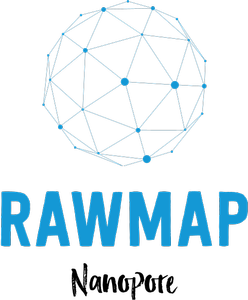

<p align="center"> 

</p>  

**Description**       
RawMap is a direct squiggle-space metagenomic classifier for filtering non-targeted reads. Inspired from brain EEG characterization, RawMap uses a Support Vector Machine (SVM) with an RBF kernel, which is trained to capture the non-linear and non-stationary characteristics of the nanopore squiggles. Each normalized squiggle segment y corresponding to  450 basepairs of a read is mapped to a 3-D feature space. Features are derived from a modified version of Hjorth parameters, where the mean and standard deviation are replaced with median and median absolute deviation respectively. RawMap has two SVM models, one trained on fast and other on slow moving reads.  
**RawMap operates in 3 stages.**
1. FAST5 data extraction and channel normalization followed by MED-MAD scaling to remove any outliers outside 5*MAD:  
2. Modified Hjorth parameter extraction (using MAD instead of STD_DEV)  
3. C_SVC SVM classifier with RBF kernel.  

**Compile and build**:  
make -j <no_of_threads>;

**Training**:
``````
>./RawMap train <file_list_to_target_reads> <file_list_to_non-target_reads>
```````
Command to generate filelist: find <repo_path> type -f | shuf > <file_list>  
Model is saved to model.data by default after training.   
**Testing**:
```````
>./RawMap test <file_list_to_target_reads> <file_list_to_non-target_reads> <model.data file name>
```````

**Output**:  
Will result in accuracy, true positive and true negative rates.

**Dependencies: (pre-installed on mbit1)**  
Tested on OpenCV version 2.4.5 (2.4.5) for CentOS, 
libhdf5,[HDF5](https://www.hdfgroup.org/downloads/hdf5/) must be installed. 


Libraries adapted:  
fast5/, used for rawdata extraction, is a modified subset of  files originally from https://github.com/jts/nanopolish


MacOS:  
compile flags in makefile needs to be re-ordered to make this work.

```````
__________________________________________________________________________________________________________________
```````
**Repo links on mbit1.eecs.umich.edu**  

**Minimap classified reads**  
separate zymo and hela runs: /y/hariss/FAST5/FAST5 (**To test load c_model.data**  )   
99:1:  
/y/hariss/FAST5/99-1/c/h  
/y/hariss/FAST5/99-1/c/z  
50:50:  
/y/hariss/FAST5/50-50/c/h,  
/y/hariss/FAST5/50-50/c/z  


**Minimap unclassified reads (**To test load uc_model.data**)**
separate zymo and hela:   
/z/scratch1/hariss/FAST5/hela/uc/      
/z/scratch1/hariss/FAST5/zymo/uc/  

Zymo sub-communities: (TBD):  
zymo community split into two sub-communities of 5 species each: /z/scratch1/hariss/FAST5/split    

**Training model tuning**    
For the best results, a model needs to be trained for each flowcell.  
View train.sh for picking the right model.  
